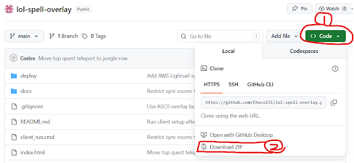

# 롤 스펠 체크 오버레이

League of Legends 상대 소환사 주문 쿨타임을 직접 눌러 추적하는 작은 Electron 오버레이입니다.

게임 화면 위에 작게 띄워 두고, 상대가 스펠을 쓰면 아이콘을 클릭해서 타이머를 시작합니다. 게임 메모리, 패킷, 클라이언트 파일은 건드리지 않는 수동 타이머입니다.

## 처음 쓰는 사람용 설치 방법

컴퓨터를 잘 몰라도 아래 순서대로 하면 됩니다. 이 프로그램은 Windows용입니다.

### 1. 파일 다운로드

GitHub 페이지에서 초록색 `Code` 버튼을 누르고 `Download ZIP`을 누릅니다.



다운로드된 ZIP 파일을 우클릭해서 `압축 풀기`를 합니다. 압축을 풀지 않고 ZIP 안에서 바로 실행하면 제대로 동작하지 않을 수 있습니다.

### 2. 처음 한 번만 실행

압축을 푼 폴더 안에서 아래 파일을 더블클릭합니다.

```text
설치_및_실행.cmd
```

이 파일은 필요한 프로그램을 설치하고 오버레이 실행까지 이어서 진행합니다. 중간에 검은 창이 뜨는 것은 정상입니다.

서버 주소를 물어보면 그냥 `Enter`를 누릅니다.

```text
Server URL [http://52.78.57.73:17898]:
```

방 번호를 물어보면 팀에서 정한 번호 `1`, `2`, `3` 중 하나를 입력합니다.

```text
Room number [1-3]: 1
```

같은 방 번호를 입력한 사람끼리만 스펠 상태가 공유됩니다.

### 3. 다음부터 실행만 할 때

이미 설치가 끝난 컴퓨터에서는 아래 파일만 더블클릭하면 됩니다.

```text
클라이언트_실행.cmd
```

서버 주소는 기본값 그대로 `Enter`, 방 번호만 입력하면 됩니다.

## 화면 구성

앱은 아주 작은 세로형 오버레이로 보입니다.


```text
[투명도 슬라이더]        [X]

TOP  [아이오니아] [우주적 통찰력] [TOP 강화텔]   [스펠] [스펠]
JUG  [아이오니아] [우주적 통찰력]                [스펠] [TOP 퀘스트 텔]
MID  [아이오니아] [우주적 통찰력]                [스펠] [스펠]
ADC  [아이오니아] [우주적 통찰력]                [스펠] [스펠]
SUP  [아이오니아] [우주적 통찰력]                [스펠] [스펠]
```

- 상단 슬라이더는 오버레이 전체 투명도를 조절합니다.
- `X` 버튼은 앱을 종료합니다.
- 각 라인 아래의 작은 아이콘은 쿨타임 보정 옵션입니다.
- 쿨타임이 돌고 있는 스펠은 아이콘이 반투명해지고, 아이콘 위에 남은 시간이 표시됩니다.
- 정글 오른쪽 칸은 TOP 퀘스트 텔레포트로 고정됩니다. 이 칸은 TOP의 아이오니아 장화/우주적 통찰력 보정을 받습니다.

## 설치 및 실행

처음 실행하는 컴퓨터에서는 아래 파일을 먼저 더블클릭하세요.

```text
설치_및_실행.cmd
```

이 파일은 다음 작업을 자동으로 시도합니다.

- Node.js 설치 여부 확인
- Node.js가 없으면 `winget`으로 Node.js LTS 설치
- `npm.cmd install`로 Electron 의존성 설치
- `electron.exe`가 누락된 경우 복구
- 서버 주소와 방 번호 입력 후 오버레이 실행

이미 설치가 끝난 컴퓨터에서는 아래 파일을 더블클릭하면 됩니다. 서버 주소는 기본값으로 들어가 있으므로 `Enter`를 누르고, 방 번호 `1`, `2`, `3` 중 하나를 입력하면 됩니다.

```text
클라이언트_실행.cmd
```

개발용으로 직접 실행하려면 아래 명령을 사용할 수 있습니다.

```cmd
npm.cmd install
npm.cmd start
```

## AWS Lightsail VPS 동기화 서버

여러 사람이 다른 네트워크에서 안정적으로 동기화하려면 AWS Lightsail Seoul 같은 VPS에 동기화 서버를 24시간 실행하는 방식을 권장합니다.

VPS에는 오버레이 창을 띄우지 않고 `sync-server.js`만 systemd 서비스로 실행합니다. 각 사용자 PC는 기존 오버레이를 설치한 뒤 `클라이언트_실행.cmd`에서 VPS 주소를 입력합니다.

```text
http://서버공인IP:17898
```

`클라이언트_실행.cmd`는 기본 서버 주소를 미리 보여주고, 방 번호를 추가로 입력받습니다. 같은 방 번호를 입력한 사람끼리만 스펠 상태가 동기화됩니다.

```text
Server URL [http://52.78.57.73:17898]:
Room number [1-3]: 1
```

서버에서 허용하는 방은 `team1`, `team2`, `team3` 세 개뿐입니다.

Lightsail 설정과 설치 명령은 [docs/AWS_LIGHTSAIL_SETUP.md](docs/AWS_LIGHTSAIL_SETUP.md)를 보세요.

## 기본 조작

- 상단 바 드래그: 오버레이 위치 이동
- 상단 슬라이더: 오버레이 전체 투명도 조절
- `X`: 종료
- `Ctrl + Shift + R`: 오버레이 창 위치와 크기 초기화
- `Esc`: 스펠 선택창 닫기

숫자 단축키로 스펠을 시작하는 기능은 없습니다. 스펠 타이머는 마우스로만 조작합니다.

## 스펠 조작

- 스펠 아이콘 좌클릭: 쿨타임 시작
- 쿨타임 중인 스펠 아이콘 좌클릭: 쿨타임 취소
- 스펠 아이콘 우클릭: 스펠 변경창 열기
- 스펠 변경창에서 아이콘 클릭: 해당 스펠로 변경

스펠 변경창은 스펠 아이콘만 표시합니다. 한 줄에 3개씩 보이고, 아래로 스크롤해서 선택합니다.

정글 행 오른쪽 칸은 TOP 퀘스트 텔레포트로 고정되어 변경할 수 없습니다. 기본 쿨타임은 420초로 추적하며, TOP 행의 아이오니아 장화/우주적 통찰력 보정을 받습니다.

## 라인별 보정 옵션

각 포지션 아래의 작은 아이콘을 눌러 해당 라인에만 쿨타임 보정을 적용합니다.

- 아이오니아 장화 아이콘: 아이오니아 장화 보정
- 우주적 통찰력 룬 아이콘: 우주적 통찰력 보정
- TOP 포지션 아이콘: 기존 텔레포트를 들고 있을 때 퀘스트 완료 후 강화 텔레포트 쿨타임으로 보정

선택된 옵션은 밝은 테두리와 글로우가 생깁니다. 선택되지 않은 옵션도 어둡게 보이므로 어떤 옵션 칸인지 구분할 수 있습니다.

## 설치 확인

설치가 제대로 끝났는지 확인하려면 CMD에서 아래 명령을 실행하세요.

```cmd
node --version
npm.cmd --version
dir node_modules\electron\dist\electron.exe
```

정상이라면 `node`, `npm` 버전이 나오고 `electron.exe` 파일이 보여야 합니다.

## 문제 해결

`electron.exe`가 없다는 메시지가 나오면 `설치_및_실행.cmd`를 다시 실행하세요.

현재 실행 스크립트는 아래 순서로 복구를 시도합니다.

1. `npm.cmd install`
2. `node node_modules\electron\install.js`
3. `npm.cmd rebuild electron`
4. Electron 패키지 재설치
5. Electron 공식 ZIP 직접 다운로드/압축 해제

그래도 실패하면 `node_modules` 폴더를 삭제한 뒤 `설치_및_실행.cmd`를 다시 실행하세요.

## 참고

- 롤은 `테두리 없음` 또는 `창 모드`로 실행하는 편이 안정적입니다.
- 일부 전체 화면 독점 모드에서는 Windows 오버레이 창이 게임 위에 보이지 않을 수 있습니다.
- 스펠 이름, 아이콘, 쿨타임은 Riot Data Dragon `16.11.1` 데이터를 기준으로 사용합니다.
- 네트워크가 막히면 내장 기본 스펠 데이터로 동작합니다.
- Riot이 승인한 공식 앱은 아닙니다. 사용 책임은 사용자에게 있습니다.
