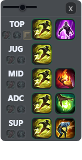

# 롤 스펠 체크 오버레이

League of Legends 상대 소환사 주문 쿨타임을 직접 눌러 추적하는 작은 Electron 오버레이입니다.

게임 화면 위에 작게 띄워 두고, 상대가 스펠을 쓰면 아이콘을 클릭해서 타이머를 시작합니다. 게임 메모리, 패킷, 클라이언트 파일은 건드리지 않는 수동 타이머입니다.

## 화면 구성

앱은 아주 작은 세로형 오버레이로 보입니다.



```text
[투명도 슬라이더]        [X]

TOP  [아이오니아] [우주적 통찰력] [TOP 강화텔]   [스펠] [스펠]
JUG  [아이오니아] [우주적 통찰력]                [스펠]
MID  [아이오니아] [우주적 통찰력]                [스펠] [스펠]
ADC  [아이오니아] [우주적 통찰력]                [스펠] [스펠]
SUP  [아이오니아] [우주적 통찰력]                [스펠] [스펠]
```

- 상단 슬라이더는 오버레이 전체 투명도를 조절합니다.
- `X` 버튼은 앱을 종료합니다.
- 각 라인 아래의 작은 아이콘은 쿨타임 보정 옵션입니다.
- 쿨타임이 돌고 있는 스펠은 아이콘이 반투명해지고, 아이콘 위에 남은 시간이 표시됩니다.
- 정글은 강타를 추적하지 않으므로 스펠 1개만 표시합니다.

## 설치 및 실행

처음 실행하는 컴퓨터에서는 아래 파일을 먼저 더블클릭하세요.

```text
설치_및_실행.cmd
```

이 파일은 다음 작업을 자동으로 시도합니다.

- Node.js 설치 여부 확인
- Node.js가 없으면 `winget`으로 Node.js LTS 설치
- `npm.cmd install`로 Electron 의존성 설치
- `electron.exe`가 누락된 경우 복구
- 오버레이 실행

이미 설치가 끝난 컴퓨터에서는 아래 파일을 더블클릭하면 됩니다. 콘솔 창 없이 실행됩니다.

```text
롤_스펠_오버레이_실행.vbs
```

문제 원인을 직접 보고 싶을 때는 아래 파일을 실행하세요. 검은 CMD 창에 설치/실행 로그가 표시됩니다.

```text
롤_스펠_오버레이_실행.cmd
```

수동 실행:

```bash
npm.cmd install
npm.cmd start
```

## 기본 조작

- 상단 바 드래그: 오버레이 위치 이동
- 상단 슬라이더: 오버레이 전체 투명도 조절
- `X`: 종료
- `Ctrl + Shift + R`: 오버레이 창 위치와 크기 초기화
- `Esc`: 스펠 선택창 닫기

숫자 단축키로 스펠을 시작하는 기능은 없습니다. 스펠 타이머는 마우스로만 조작합니다.

## 스펠 조작

- 스펠 아이콘 좌클릭: 쿨타임 시작
- 쿨타임 중인 스펠 아이콘 좌클릭: 쿨타임 취소
- 스펠 아이콘 우클릭: 스펠 변경창 열기
- 스펠 변경창에서 아이콘 클릭: 해당 스펠로 변경

스펠 변경창은 스펠 아이콘만 표시합니다. 한 줄에 3개씩 보이고, 아래로 스크롤해서 선택합니다.

## 라인별 보정 옵션

각 포지션 아래의 작은 아이콘을 눌러 해당 라인에만 쿨타임 보정을 적용합니다.

- 아이오니아 장화 아이콘: 아이오니아 장화 보정
- 우주적 통찰력 룬 아이콘: 우주적 통찰력 보정
- TOP 포지션 아이콘: TOP 전용 강화 텔레포트 보정

선택된 옵션은 밝은 테두리와 글로우가 생깁니다. 선택되지 않은 옵션도 어둡게 보이므로 어떤 옵션 칸인지 구분할 수 있습니다.

## 설치 확인

설치가 제대로 끝났는지 확인하려면 CMD에서 아래 명령을 실행하세요.

```cmd
node --version
npm.cmd --version
dir node_modules\electron\dist\electron.exe
```

정상이라면 `node`, `npm` 버전이 나오고 `electron.exe` 파일이 보여야 합니다.

## 문제 해결

`electron.exe`가 없다는 메시지가 나오면 `설치_및_실행.cmd`를 다시 실행하세요.

현재 실행 스크립트는 아래 순서로 복구를 시도합니다.

1. `npm.cmd install`
2. `node node_modules\electron\install.js`
3. `npm.cmd rebuild electron`
4. Electron 패키지 재설치
5. Electron 공식 ZIP 직접 다운로드/압축 해제

그래도 실패하면 `node_modules` 폴더를 삭제한 뒤 `설치_및_실행.cmd`를 다시 실행하세요.

## 참고

- 롤은 `테두리 없음` 또는 `창 모드`로 실행하는 편이 안정적입니다.
- 일부 전체 화면 독점 모드에서는 Windows 오버레이 창이 게임 위에 보이지 않을 수 있습니다.
- 스펠 이름, 아이콘, 쿨타임은 Riot Data Dragon `16.11.1` 데이터를 기준으로 사용합니다.
- 네트워크가 막히면 내장 기본 스펠 데이터로 동작합니다.
- Riot이 승인한 공식 앱은 아닙니다. 사용 책임은 사용자에게 있습니다.
